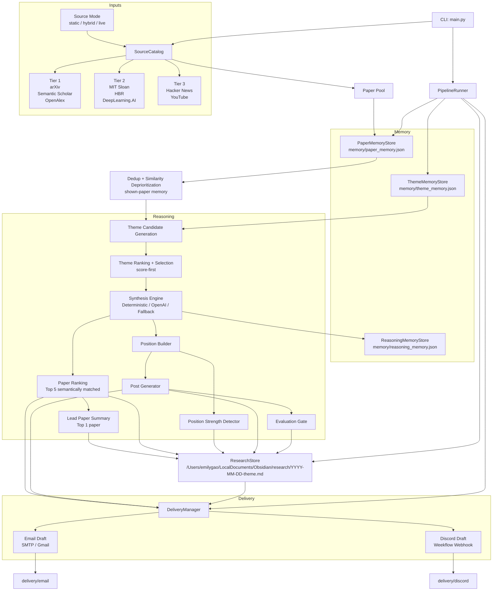

# Architecture Overview

## Purpose

`deep-agents` is a local-first research-to-content pipeline that turns a tiered
paper pool into a debatable enterprise AI position, a LinkedIn-ready post, a
research note, and delivery artifacts for email and Discord.

The architecture follows the design in `genai_pipeline_v5.md`, but this
document describes the system that is actually implemented in the repository
today.

The current implementation is a hybrid architecture:

- live ingestion where stable source interfaces exist
- RSS-backed ingestion where feeds are user-supplied
- static fallback sources for local reliability
- optional LLM synthesis with deterministic fallback and explicit fallback provenance

## Core Flow

1. Load a source catalog across research, interpretation, and signal tiers.
2. Build a paper pool from all configured sources.
3. Remove exact duplicates and deprioritize highly similar papers, including papers already shown in previous runs.
4. Check theme memory so selected topics used in the last 6 months are not reused.
5. Extract 1 to 5 meaningful candidate themes from the deduped paper pool.
6. Apply a score-first theme-selection pass, with `enterprise relevance` as the only hard theme filter.
7. Build the position and score its strength.
8. Rank semantically matched papers and keep the top 5 for the output set.
9. Use the top 1 ranked paper as the lead paper and generate the LinkedIn draft from the selected theme.
10. Score the final output with the evaluation gate.
11. Persist a research note to the Obsidian research vault.
12. Generate and optionally send delivery outputs for email and Discord.

## Full Stack Diagram

## Runtime Layers

### 1. Entry Layer

- `main.py`
- Parses CLI flags such as `--ignore-memory`, `--live-email`, and
  `--live-discord`
- Loads `.env`
- Instantiates `PipelineRunner`

### 2. Source Layer

- `deep_agents/sources.py`
- `deep_agents/samples.py`

Responsibilities:

- define the `SourceCatalog`
- represent each source as a fetchable unit
- provide live adapters for official APIs and configurable RSS feeds
- provide static fallback sources for deterministic local operation
- avoid unsupported direct automation against Google Scholar, which does not
  expose a public official search API for this use case

The source layer now supports three modes:

- `static`
- `hybrid`
- `live`

`hybrid` is the operational default. It prefers live adapters and falls back to
the static source set when live fetching fails.

Current adapter types:

- API-backed adapters:
  - arXiv
  - Semantic Scholar
  - OpenAlex
  - Hacker News
  - YouTube
- RSS-backed adapters:
  - MIT Sloan Management Review
  - Harvard Business Review
  - DeepLearning.AI
- static fallback adapters:
  - local sample paper sets for every tier

### 3. Memory Layer

- `deep_agents/memory.py`

Responsibilities:

- persist paper fingerprints in `memory/paper_memory.json`
- persist recent themes in `memory/theme_memory.json`
- persist decision-aware run history in `memory/reasoning_memory.json`
- enforce exact deduplication
- deprioritize high-similarity titles
- filter out papers that were actually shown in previous runs
- reject repeated selected themes from the last 6 months

### 4. Reasoning Layer

- `deep_agents/heuristics.py`
- `deep_agents/synthesis.py`
- `deep_agents/pipeline.py`

Responsibilities:

- generate theme candidates from the paper pool
- retry weak theme generations with paradigm-elevation guidance
- rank candidate themes instead of hard-rejecting most of them
- keep explicit provenance when OpenAI falls back to deterministic synthesis
- route reasoning through a pluggable synthesis engine
- select one winning theme
- keep additional viable themes as alternatives rather than mislabeling them as rejected
- derive the contrarian position
- score position strength
- generate the LinkedIn draft
- evaluate the final output

The reasoning layer now supports:

- deterministic heuristic synthesis
- OpenAI-backed synthesis
- automatic fallback from OpenAI to deterministic synthesis for theme-generation failures

The deterministic path remains the safety net for tests, offline runs, and any
LLM runtime failure during theme generation. Fallback runs are now explicitly
logged and live delivery is blocked when fallback is used.

### Implemented LLM Path

The OpenAI path now owns the reasoning stages that benefit most from judgment,
while the deterministic path remains the reliability fallback.

- Theme synthesis:
  - implemented in `deep_agents/synthesis.py`
  - the OpenAI engine generates up to 5 meaningful themes directly from the
    paper pool instead of inheriting a heuristic-selected shortlist
  - it is allowed to return fewer themes when the paper pool is narrow
  - the prompt distinguishes `incremental improvement` from `paradigm
    challenge` and asks for shifts in thinking rather than topic summaries
  - retry guidance explicitly asks for abstractions in the form `Shift from X
    to Y` when the first pass is too descriptive
- Debate filter:
  - implemented jointly in `deep_agents/synthesis.py` and
    `deep_agents/heuristics.py`
  - hard binary rejection is intentionally narrow in the current system
  - the only hard theme-selection filter is `enterprise relevance < 3`
  - most other quality checks now act as soft scoring or evaluation penalties:
    - debate score
    - specificity
    - paradigm signal
    - different mental model
    - trade-off framing
    - debate potential
  - generic importance claims such as `X is important and should be done more`
    still lower quality scores and can hurt final evaluation
  - architectural discomfort is a ranking preference, not a hard survival
    condition
- Theme selection:
  - implemented in `deep_agents/synthesis.py`
  - winner selection is deterministic and score-based once enterprise-relevant
    candidate themes exist
  - valid runner-up themes are preserved as `alternative_themes`
  - low-relevance themes are still moved into `rejected_themes`
- Position:
  - implemented through the selected theme payload in
    `deep_agents/synthesis.py`
  - the OpenAI engine is prompted to force a stance and reframe the problem:
    common belief, why that framing is wrong, the correct mental model, and the
    enterprise implication
  - positions are still retried and scored, but the runtime now prefers
    score-first degradation over fail-closed rejection for most quality misses
- Post generation:
  - implemented in `deep_agents/synthesis.py`
  - the OpenAI engine writes a tight, opinionated LinkedIn post capped by local
    guardrails
  - if post generation cannot satisfy the stricter OpenAI output contract, the
    runtime falls back to a deterministic post built from the selected
    position/theme
- Evaluation:
  - implemented in `deep_agents/evaluation.py`
  - the OpenAI evaluator scores novelty, relevance, insight, position
    strength, and clarity
  - local guardrails cap inflated scores when the idea is incremental,
    consensus-aligned, generic, lacking debate potential, or missing stronger
    reframing signals
  - evaluation is now primarily a scoring layer rather than a broad run-stop
    mechanism

### Hard vs Soft Filters

Current hard filters:

- no papers remain after deduplication and shown-paper memory
- no candidate themes are available for ranking
- no theme meets the minimum enterprise relevance threshold

Current soft filters and score penalties:

- debate score
- specificity
- paradigm signal
- different mental model
- trade-off framing
- debate potential
- consensus alignment
- generic importance claims
- weak position framing
- weak post quality

Operational split in the current architecture:

- Dedup: heuristic
- Memory filter: heuristic
- Theme synthesis: LLM with deterministic fallback
- Theme selection: deterministic weighted scoring with enterprise relevance as a hard gate
- Position: LLM with deterministic retry and score-first degradation
- Post generation: LLM with deterministic fallback
- Paper ranking: deterministic semantic ranking over selected/alternative themes
- Evaluation: hybrid LLM plus deterministic guardrails

### Stage Classification

| Step | Type | Current behavior |
| --- | --- | --- |
| Load source catalog | Deterministic | Static config and environment-driven source setup |
| Fetch source papers | Deterministic | API and RSS calls are external, but the code path is fixed |
| Dedup exact papers | Deterministic | Fingerprint-based |
| Deprioritize similar titles | Deterministic | Similarity-threshold rule |
| Filter previously shown papers | Deterministic | `paper_memory.json` |
| Filter previously selected themes | Deterministic | 6-month `theme_memory.json` window |
| Generate candidate themes | Probabilistic | OpenAI path when enabled; deterministic fallback exists |
| Retry weak theme generation | Probabilistic | Prompted retry loop in OpenAI synthesis |
| Enterprise relevance gate | Deterministic | Only hard theme-selection filter |
| Select winning theme | Deterministic | Score-based ranking in code |
| Keep alternative themes | Deterministic | Valid runner-up themes preserved in code |
| Build position | Probabilistic | OpenAI-generated when enabled; deterministic fallback and recovery path exist |
| Score position strength | Deterministic | Rule-based scoring and caps |
| Rank top papers | Deterministic | Semantic and heuristic ranking in code |
| Pick lead paper | Deterministic | Top 1 from ranked paper set |
| Generate LinkedIn post | Probabilistic | OpenAI-generated when enabled; deterministic fallback exists |
| Score and evaluate final output | Hybrid, but mostly Deterministic | LLM evaluator is optional; deterministic caps and scoring always apply |
| Persist run log, note, and memory | Deterministic | File writes and structured state |
| Prepare email and Discord payloads | Deterministic | Rendered from selected artifacts |
| Send email and Discord | Deterministic | Direct send path; blocked if synthesis fallback was used |

### 5. Storage Layer

- `deep_agents/storage.py`

Responsibilities:

- write a markdown research note under `/Users/emilygao/LocalDocuments/Obsidian/research/`
- write a per-run JSON trace under `runs/run_YYYY-MM-DD.json`
- preserve short-term execution state for each run as structured data
- capture:
  - paper-pool counts
  - top 5 ranked papers
  - lead paper summary
  - candidate themes
  - selected theme
  - alternative themes
  - rejected themes
  - rejection reasons
  - scorecards
  - position
  - position strength
  - LinkedIn draft
  - reference links
  - evaluation
  - delivery paths

### 6. Delivery Layer

- `deep_agents/delivery.py`

Responsibilities:

- write email and Discord delivery drafts locally
- optionally send live email via SMTP or Gmail app-password auth
- optionally send live Discord messages through the Weekflow webhook in
  `/Users/emilygao/LocalDocuments/Projects/Weekflow/config.py`
- include the ranked top-paper set with citation URLs and summaries in delivery
  drafts
- block live sending when synthesis fell back to deterministic output
- return delivery status back to the pipeline

## Code Map

| Area | File | Role |
| --- | --- | --- |
| Entry point | `main.py` | CLI execution |
| Contracts | `deep_agents/models.py` | Typed dataclasses for papers, themes, results, deliveries |
| Sources | `deep_agents/sources.py` | Source interfaces and catalog |
| Sample data | `deep_agents/samples.py` | Local tiered source implementation |
| Memory | `deep_agents/memory.py` | Shown-paper memory, theme memory, and reasoning memory |
| Reasoning | `deep_agents/heuristics.py` | Theme extraction, ranking heuristics, position, post |
| Reasoning runtime | `deep_agents/synthesis.py` | Deterministic and OpenAI synthesis engines |
| Orchestration | `deep_agents/pipeline.py` | End-to-end runtime flow |
| Storage | `deep_agents/storage.py` | Research note persistence and run logs |
| Delivery | `deep_agents/delivery.py` | Draft generation and live send paths |
| Tests | `tests/test_pipeline.py` | Unit and pipeline verification |

## Data Artifacts

### Inputs

- source papers from the configured source catalog
- environment configuration from `.env`
- optional Weekflow webhook from:
  `/Users/emilygao/LocalDocuments/Projects/Weekflow/config.py`
- optional source-mode and synthesis-engine environment configuration

Important runtime environment keys:

- `DEEP_AGENTS_SOURCE_MODE`
- `DEEP_AGENTS_SYNTHESIS_ENGINE`
- `DEEP_AGENTS_OPENAI_MODEL`
- `OPENALEX_API_KEY`
- `SEMANTIC_SCHOLAR_API_KEY`
- `YOUTUBE_API_KEY`
- source-specific RSS URLs
- SMTP or Gmail credentials for live email

### Persistent Outputs

- `memory/paper_memory.json`
- `memory/theme_memory.json`
- `memory/reasoning_memory.json`
- `runs/run_YYYY-MM-DD.json`
- `/Users/emilygao/LocalDocuments/Obsidian/research/YYYY-MM-DD-theme.md`
- `delivery/email/YYYY-MM-DD-linkedin-draft.md`
- `delivery/discord/YYYY-MM-DD-linkedin-draft.md`

`memory/paper_memory.json` now stores the fingerprints of papers that were
actually shown in outputs, not the full fetched pool.

## Delivery Integration

### Email

Email credentials are read from `.env`.

Supported modes:

- generic SMTP:
  - `SMTP_HOST`
  - `SMTP_PORT`
  - `SMTP_USERNAME`
  - `SMTP_PASSWORD`
  - `SMTP_FROM_EMAIL`

- Gmail app-password mode:
  - `GMAIL_SENDER_EMAIL`
  - `GMAIL_APP_PASSWORD`

### Discord

The live Discord path uses the Weekflow webhook config:

- file:
  `/Users/emilygao/LocalDocuments/Projects/Weekflow/config.py`
- key:
  `API_KEYS["weekflow_discord_card_notify"]`

## Architectural Decisions

### Local-First with Live Adapters

The pipeline remains runnable without network dependencies, but the source layer
now supports live adapters behind the same catalog contract.

### Pluggable Synthesis Engine

Reasoning is no longer hard-coded to one implementation. The system can use an
OpenAI-backed synthesis engine while preserving deterministic fallback.

This keeps correctness-sensitive workflow stages deterministic:

- memory checks
- deduplication
- enterprise relevance gating
- selection constraints
- ranked paper selection
- persistence
- delivery status handling

The fallback boundary is intentional:

- theme-generation failures can fall back to deterministic synthesis
- fallback provenance is persisted into the run log and research note
- live delivery is blocked when fallback is used

### Quality-First Theme Filtering

The architecture no longer treats theme count as a quality signal.

Instead, the system prefers:

- `1 to 5` meaningful themes over filler themes
- deterministic ranking over broad binary rejection
- explicit enterprise relevance gating over broad ideological filtering
- semantic ranking of top papers over naive remainder-list backfill

This is the core shift from a count-based contract to a score-first,
quality-based contract.

### Live Delivery as an Edge Concern

Email and Discord sending are isolated in `DeliveryManager`. The rest of the
pipeline only produces structured outputs and delivery intent.

### Memory is a Policy Layer

Paper memory and theme memory are not convenience features. They are policy
controls that enforce novelty and reduce repeated output.

In the current implementation:

- paper memory suppresses papers that were actually shown in previous runs
- theme memory suppresses previously selected themes over a 6-month window
- reasoning memory preserves the selected theme, alternative themes, and scored
  decision context for each run

## Current Limitations

- several live sources depend on configurable RSS URLs rather than official APIs
- the top-paper ranking is still lexical/semantic heuristic matching rather than
  a full embedding or citation-aware ranker
- Hacker News uses the HN item timestamp, not the linked article publication
  date
- theme generation can still drift toward weak topics in narrow or noisy paper
  pools
- Discord sending uses a single Weekflow webhook path
- email sending depends on local SMTP credentials
- there is no scheduler or service wrapper yet

## Recommended Next Steps

1. Add richer query configuration and per-source fetch telemetry.
2. Replace remaining RSS-backed publisher sources where reliable official APIs become available.
3. Upgrade paper ranking from lexical overlap to embeddings or citation-aware relevance scoring.
4. Split delivery into provider-specific adapters with richer status reporting.
5. Add a scheduler or job runner for unattended daily execution.
