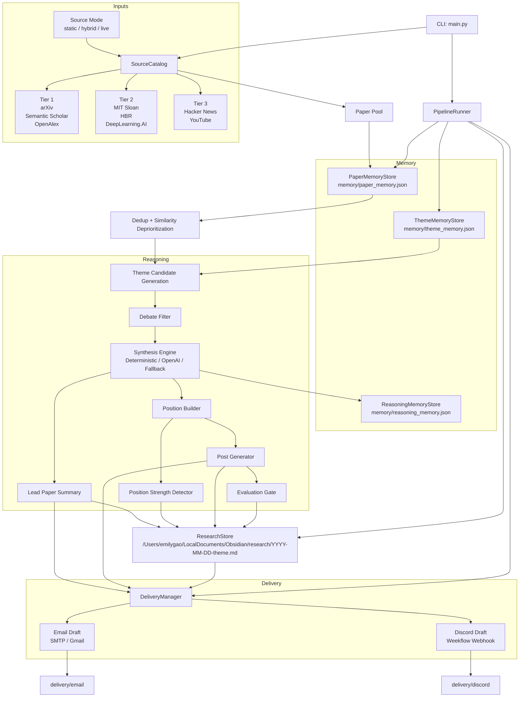

# Architecture Overview

## Purpose

`deep-agents` is a local-first research-to-content pipeline that turns a tiered
paper pool into a debatable enterprise AI position, a LinkedIn-ready post, a
research note, and delivery artifacts for email and Discord.

The architecture follows the design in `genai_pipeline_v5.md`, but this
document describes the system that is actually implemented in the repository
today.

The current implementation is a hybrid architecture:

- live ingestion where stable source interfaces exist
- RSS-backed ingestion where feeds are user-supplied
- static fallback sources for local reliability
- optional LLM synthesis with deterministic fallback

## Core Flow

1. Load a source catalog across research, interpretation, and signal tiers.
2. Build a paper pool from all configured sources.
3. Remove exact duplicates and deprioritize highly similar papers.
4. Check theme memory so topics used in the last 6 months are not reused.
5. Extract 3 to 5 candidate themes from the deduped paper pool.
6. Apply the debate filter and select one strong theme.
7. Build the position and score its strength.
8. Generate a multi-paragraph LinkedIn draft.
9. Score the final output with the evaluation gate.
10. Persist a research note to the Obsidian research vault.
11. Generate and optionally send delivery outputs for email and Discord.

## Full Stack Diagram

## Runtime Layers

### 1. Entry Layer

- `main.py`
- Parses CLI flags such as `--ignore-memory`, `--live-email`, and
  `--live-discord`
- Loads `.env`
- Instantiates `PipelineRunner`

### 2. Source Layer

- `deep_agents/sources.py`
- `deep_agents/samples.py`

Responsibilities:

- define the `SourceCatalog`
- represent each source as a fetchable unit
- provide live adapters for official APIs and configurable RSS feeds
- provide static fallback sources for deterministic local operation
- avoid unsupported direct automation against Google Scholar, which does not
  expose a public official search API for this use case

The source layer now supports three modes:

- `static`
- `hybrid`
- `live`

`hybrid` is the operational default. It prefers live adapters and falls back to
the static source set when live fetching fails.

Current adapter types:

- API-backed adapters:
  - arXiv
  - Semantic Scholar
  - OpenAlex
  - Hacker News
  - YouTube
- RSS-backed adapters:
  - MIT Sloan Management Review
  - Harvard Business Review
  - DeepLearning.AI
- static fallback adapters:
  - local sample paper sets for every tier

### 3. Memory Layer

- `deep_agents/memory.py`

Responsibilities:

- persist paper fingerprints in `memory/paper_memory.json`
- persist recent themes in `memory/theme_memory.json`
- persist decision-aware run history in `memory/reasoning_memory.json`
- enforce exact deduplication
- deprioritize high-similarity titles
- reject repeated themes from the last 6 months

### 4. Reasoning Layer

- `deep_agents/heuristics.py`
- `deep_agents/synthesis.py`
- `deep_agents/pipeline.py`

Responsibilities:

- generate theme candidates from the paper pool
- apply the debate filter
- route reasoning through a pluggable synthesis engine
- select one winning theme
- derive the contrarian position
- score position strength
- generate the LinkedIn draft
- evaluate the final output

The reasoning layer now supports:

- deterministic heuristic synthesis
- OpenAI-backed synthesis
- automatic fallback from OpenAI to deterministic synthesis

The deterministic path remains the safety net for tests, offline runs, and any
LLM runtime failure.

### Implemented LLM Path

The OpenAI path now owns the reasoning stages that benefit most from judgment,
while the deterministic path remains the reliability fallback.

- Theme synthesis:
  - implemented in `deep_agents/synthesis.py`
  - the OpenAI engine generates 3 to 5 candidate themes directly from the
    paper pool instead of inheriting a heuristic-selected shortlist
  - each candidate includes rationale, position fields, score inputs, and
    supporting paper references
- Debate filter:
  - implemented in `deep_agents/synthesis.py`
  - the OpenAI engine decides which themes are debatable enough to survive
  - rejected themes must include explicit rejection reasons
  - exactly one theme is allowed to survive with `rejection_reason = null`
- Position:
  - implemented through the selected theme payload in
    `deep_agents/synthesis.py`
  - the OpenAI engine supplies the common belief, contrarian view, why wrong,
    recommendation, and enterprise implication for the chosen theme
- Post generation:
  - implemented in `deep_agents/synthesis.py`
  - the OpenAI engine returns exactly 3 short paragraphs for the final post
- Evaluation:
  - implemented in `deep_agents/evaluation.py`
  - the OpenAI evaluator scores novelty, relevance, insight, position
    strength, and clarity
  - local guardrails still enforce hard constraints such as maximum post length
    and minimum viable position strength

Operational split in the current architecture:

- Dedup: heuristic
- Memory filter: heuristic
- Theme synthesis: LLM with deterministic fallback
- Debate filter: LLM with deterministic fallback
- Position: LLM with deterministic fallback
- Post generation: LLM with deterministic fallback
- Evaluation: hybrid LLM plus deterministic guardrails

### 5. Storage Layer

- `deep_agents/storage.py`

Responsibilities:

- write a markdown research note under `/Users/emilygao/LocalDocuments/Obsidian/research/`
- write a per-run JSON trace under `runs/run_YYYY-MM-DD.json`
- capture:
  - paper-pool counts
  - lead paper summary
  - candidate themes
  - selected theme
  - rejected themes
  - rejection reasons
  - scorecards
  - position
  - position strength
  - LinkedIn draft
  - reference links
  - evaluation
  - delivery paths

### 6. Delivery Layer

- `deep_agents/delivery.py`

Responsibilities:

- write email and Discord delivery drafts locally
- optionally send live email via SMTP or Gmail app-password auth
- optionally send live Discord messages through the Weekflow webhook in
  `/Users/emilygao/LocalDocuments/Projects/Weekflow/config.py`
- return delivery status back to the pipeline

## Code Map

| Area | File | Role |
| --- | --- | --- |
| Entry point | `main.py` | CLI execution |
| Contracts | `deep_agents/models.py` | Typed dataclasses for papers, themes, results, deliveries |
| Sources | `deep_agents/sources.py` | Source interfaces and catalog |
| Sample data | `deep_agents/samples.py` | Local tiered source implementation |
| Memory | `deep_agents/memory.py` | Paper, theme, and reasoning memory |
| Reasoning | `deep_agents/heuristics.py` | Theme extraction, debate filter, position, post |
| Reasoning runtime | `deep_agents/synthesis.py` | Deterministic and OpenAI synthesis engines |
| Orchestration | `deep_agents/pipeline.py` | End-to-end runtime flow |
| Storage | `deep_agents/storage.py` | Research note persistence and run logs |
| Delivery | `deep_agents/delivery.py` | Draft generation and live send paths |
| Tests | `tests/test_pipeline.py` | Unit and pipeline verification |

## Data Artifacts

### Inputs

- source papers from the configured source catalog
- environment configuration from `.env`
- optional Weekflow webhook from:
  `/Users/emilygao/LocalDocuments/Projects/Weekflow/config.py`
- optional source-mode and synthesis-engine environment configuration

Important runtime environment keys:

- `DEEP_AGENTS_SOURCE_MODE`
- `DEEP_AGENTS_SYNTHESIS_ENGINE`
- `DEEP_AGENTS_OPENAI_MODEL`
- `OPENALEX_API_KEY`
- `SEMANTIC_SCHOLAR_API_KEY`
- `YOUTUBE_API_KEY`
- source-specific RSS URLs
- SMTP or Gmail credentials for live email

### Persistent Outputs

- `memory/paper_memory.json`
- `memory/theme_memory.json`
- `/Users/emilygao/LocalDocuments/Obsidian/research/YYYY-MM-DD-theme.md`
- `delivery/email/YYYY-MM-DD-linkedin-draft.md`
- `delivery/discord/YYYY-MM-DD-linkedin-draft.md`

## Delivery Integration

### Email

Email credentials are read from `.env`.

Supported modes:

- generic SMTP:
  - `SMTP_HOST`
  - `SMTP_PORT`
  - `SMTP_USERNAME`
  - `SMTP_PASSWORD`
  - `SMTP_FROM_EMAIL`

- Gmail app-password mode:
  - `GMAIL_SENDER_EMAIL`
  - `GMAIL_APP_PASSWORD`

### Discord

The live Discord path uses the Weekflow webhook config:

- file:
  `/Users/emilygao/LocalDocuments/Projects/Weekflow/config.py`
- key:
  `API_KEYS["weekflow_discord_card_notify"]`

## Architectural Decisions

### Local-First with Live Adapters

The pipeline remains runnable without network dependencies, but the source layer
now supports live adapters behind the same catalog contract.

### Pluggable Synthesis Engine

Reasoning is no longer hard-coded to one implementation. The system can use an
OpenAI-backed synthesis engine while preserving deterministic fallback.

This keeps correctness-sensitive workflow stages deterministic:

- memory checks
- deduplication
- selection constraints
- persistence
- delivery status handling

### Live Delivery as an Edge Concern

Email and Discord sending are isolated in `DeliveryManager`. The rest of the
pipeline only produces structured outputs and delivery intent.

### Memory is a Policy Layer

Paper memory and theme memory are not convenience features. They are policy
controls that enforce novelty and reduce repeated output.

## Current Limitations

- several live sources depend on configurable RSS URLs rather than official APIs
- OpenAI synthesis is bounded by deterministic candidate generation rather than
  end-to-end autonomous reasoning
- Discord sending uses a single Weekflow webhook path
- email sending depends on local SMTP credentials
- there is no scheduler or service wrapper yet

## Recommended Next Steps

1. Add richer query configuration and per-source fetch telemetry.
2. Replace remaining RSS-backed publisher sources where reliable official APIs become available.
3. Split delivery into provider-specific adapters with richer status reporting.
4. Add a scheduler or job runner for unattended daily execution.
5. Add structured run logs and run history for operational observability.
