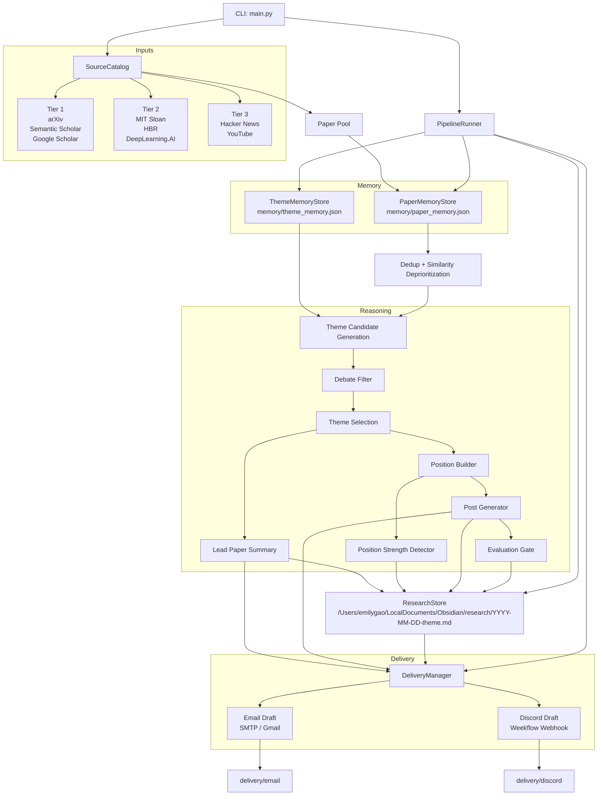

# Architecture Overview

## Purpose

`deep-agents` is a local-first research-to-content pipeline that turns a tiered
paper pool into a debatable enterprise AI position, a LinkedIn-ready post, a
research note, and delivery artifacts for email and Discord.

The architecture follows the design in `genai_pipeline_v5.md`, but this
document describes the system that is actually implemented in the repository
today.

## Core Flow

1. Load a source catalog across research, interpretation, and signal tiers.
2. Build a paper pool from all configured sources.
3. Remove exact duplicates and deprioritize highly similar papers.
4. Check theme memory so recent topics are not reused.
5. Extract 3 to 5 candidate themes from the deduped paper pool.
6. Apply the debate filter and select one strong theme.
7. Build the position and score its strength.
8. Generate a multi-paragraph LinkedIn draft.
9. Score the final output with the evaluation gate.
10. Persist a research note to the Obsidian research vault.
11. Generate and optionally send delivery outputs for email and Discord.

## Full Stack Diagram

## Runtime Layers

### 1. Entry Layer

- `main.py`
- Parses CLI flags such as `--ignore-memory`, `--live-email`, and
  `--live-discord`
- Loads `.env`
- Instantiates `PipelineRunner`

### 2. Source Layer

- `deep_agents/sources.py`
- `deep_agents/samples.py`

Responsibilities:

- define the `SourceCatalog`
- represent each source as a fetchable unit
- provide the current local static implementation of the source tiers

Current implementation is local and deterministic. The interface is shaped so
live fetch adapters can replace static sample sources later without changing the
pipeline contract.

### 3. Memory Layer

- `deep_agents/memory.py`

Responsibilities:

- persist paper fingerprints in `memory/paper_memory.json`
- persist recent themes in `memory/theme_memory.json`
- enforce exact deduplication
- deprioritize high-similarity titles
- reject repeated themes from the last three runs

### 4. Reasoning Layer

- `deep_agents/heuristics.py`
- `deep_agents/pipeline.py`

Responsibilities:

- generate theme candidates from the paper pool
- apply the debate filter
- select one winning theme
- derive the contrarian position
- score position strength
- generate the LinkedIn draft
- evaluate the final output

This layer is currently deterministic and heuristic-driven rather than
LLM-driven. That keeps the pipeline stable, testable, and runnable without paid
API dependencies.

### 5. Storage Layer

- `deep_agents/storage.py`

Responsibilities:

- write a markdown research note under `/Users/emilygao/LocalDocuments/Obsidian/research/`
- capture:
  - paper-pool counts
  - lead paper summary
  - selected theme
  - rejected themes
  - position
  - position strength
  - LinkedIn draft
  - reference links
  - evaluation
  - delivery paths

### 6. Delivery Layer

- `deep_agents/delivery.py`

Responsibilities:

- write email and Discord delivery drafts locally
- optionally send live email via SMTP or Gmail app-password auth
- optionally send live Discord messages through the Weekflow webhook in
  `/Users/emilygao/LocalDocuments/Projects/Weekflow/config.py`
- return delivery status back to the pipeline

## Code Map

| Area | File | Role |
| --- | --- | --- |
| Entry point | `main.py` | CLI execution |
| Contracts | `deep_agents/models.py` | Typed dataclasses for papers, themes, results, deliveries |
| Sources | `deep_agents/sources.py` | Source interfaces and catalog |
| Sample data | `deep_agents/samples.py` | Local tiered source implementation |
| Memory | `deep_agents/memory.py` | Paper and theme memory |
| Reasoning | `deep_agents/heuristics.py` | Theme extraction, debate filter, position, post |
| Orchestration | `deep_agents/pipeline.py` | End-to-end runtime flow |
| Storage | `deep_agents/storage.py` | Research note persistence |
| Delivery | `deep_agents/delivery.py` | Draft generation and live send paths |
| Tests | `tests/test_pipeline.py` | Unit and pipeline verification |

## Data Artifacts

### Inputs

- source papers from the configured source catalog
- environment configuration from `.env`
- optional Weekflow webhook from:
  `/Users/emilygao/LocalDocuments/Projects/Weekflow/config.py`

### Persistent Outputs

- `memory/paper_memory.json`
- `memory/theme_memory.json`
- `/Users/emilygao/LocalDocuments/Obsidian/research/YYYY-MM-DD-theme.md`
- `delivery/email/YYYY-MM-DD-linkedin-draft.md`
- `delivery/discord/YYYY-MM-DD-linkedin-draft.md`

## Delivery Integration

### Email

Supported auth modes:

- generic SMTP:
  - `SMTP_HOST`
  - `SMTP_PORT`
  - `SMTP_USERNAME`
  - `SMTP_PASSWORD`
  - `SMTP_FROM_EMAIL`
- Gmail app-password mode:
  - `GMAIL_SENDER_EMAIL`
  - `GMAIL_APP_PASSWORD`

### Discord

The live Discord path uses the Weekflow webhook config:

- file:
  `/Users/emilygao/LocalDocuments/Projects/Weekflow/config.py`
- key:
  `API_KEYS["weekflow_discord_card_notify"]`

## Architectural Decisions

### Local-First by Default

The pipeline is intentionally runnable without network dependencies for paper
ingestion. Static sample sources make development, testing, and review stable.

### Deterministic Thought Engine

Theme extraction and selection are implemented heuristically instead of by an
LLM. This keeps the behavior inspectable and makes test coverage realistic.

### Live Delivery as an Edge Concern

Email and Discord sending are isolated in `DeliveryManager`. The rest of the
pipeline only produces structured outputs and delivery intent.

### Memory is a Policy Layer

Paper memory and theme memory are not convenience features. They are policy
controls that enforce novelty and reduce repeated output.

## Current Limitations

- source ingestion is static, not yet connected to live APIs
- theme synthesis is heuristic, not model-driven
- Discord sending uses a single Weekflow webhook path
- email sending depends on local SMTP credentials
- there is no scheduler or service wrapper yet

## Recommended Next Steps

1. Replace static sample sources with live adapters behind `SourceCatalog`.
2. Add a pluggable LLM synthesis engine while preserving deterministic fallback.
3. Split delivery into provider-specific adapters with richer status reporting.
4. Add a scheduler or job runner for unattended daily execution.
5. Add structured run logs and run history for operational observability.
